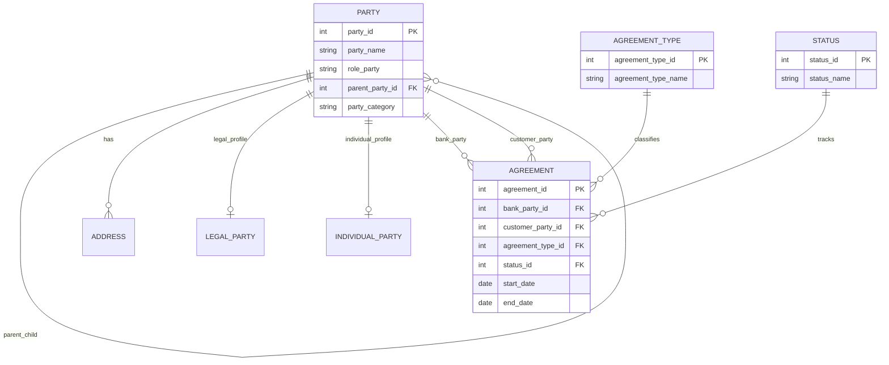
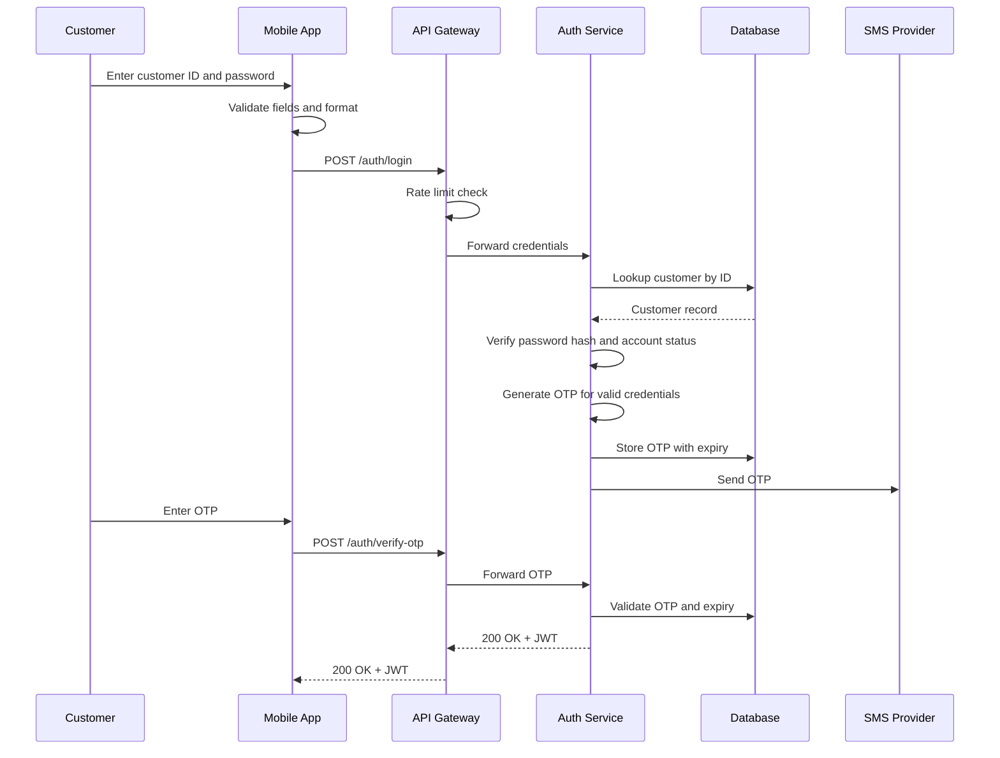

# Gen AI Financial IQ Contract Ingestion

Agentic banking research portfolio project focused on conversational contract ingestion, agreement data modeling, authentication flow design, and SQL reasoning.

This repository packages three interview-style assessments into a public-safe banking product and data architecture case study.

## Project Summary

The project demonstrates how a banking platform can combine structured agreement data, secure customer authentication, and GenAI-assisted contract ingestion to create a Financial IQ layer for relationship managers, operations teams, and digital banking users.

## Included Assessments

- [SQL country match pairing assignment](docs/sql-country-match-pairs.md)
- [Agreement ERD and party data model](docs/agreement-erd-data-model.md)
- [Mobile banking authentication sequence flow](docs/mobile-auth-sequence-flow.md)
- [Agentic banking product concept](docs/agentic-banking-product-concept.md)

## Source Files

- [SQL solution](sql/country_match_pairs.sql)
- [ERD Mermaid source](diagrams/agreement_erd.mmd)
- [Sequence flow Mermaid source](diagrams/mobile_auth_sequence.mmd)

## Visual Diagrams

### Agreement ERD

### Mobile Banking Login Sequence

## Product Positioning

Financial IQ Contract Ingestion is a GenAI-assisted banking capability that can:

- Ingest agreement and contract documents
- Extract parties, agreement types, status, obligations, dates, and addresses
- Map extracted entities into canonical banking data models
- Support human review for ambiguous clauses
- Provide conversational search over banking agreements
- Maintain audit traceability across ingestion, extraction, validation, and retrieval

## Skills Demonstrated

- SQL self-join logic
- ERD design and normalization
- Recursive party hierarchy modeling
- Banking agreement domain modeling
- Mobile authentication flow design
- API gateway and auth service sequencing
- OTP, JWT, lockout, and rate-limit logic
- GenAI product framing for banking data platforms

## Disclaimer

This is a public-safe portfolio project based on personal assessment preparation. It does not include client data, customer data, production code, proprietary banking implementation, or confidential documents.
