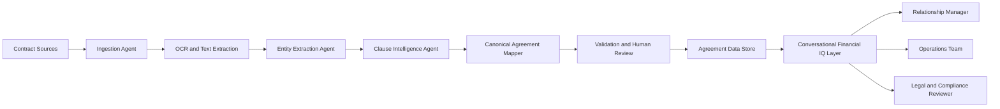

# Agentic Banking Product Concept

## Product Name

Gen AI Financial IQ Contract Ingestion

## Concept

Financial IQ Contract Ingestion is a GenAI-assisted banking capability that converts agreement documents into structured, governed, searchable contract intelligence.

The system ingests banking agreements, extracts entities and clauses, maps them into a canonical agreement data model, and supports conversational retrieval for relationship managers, operations teams, legal reviewers, and product teams.

## Core User Problem

Banking agreements often sit across PDFs, scanned documents, email attachments, contract repositories, and operational systems. Teams need faster answers to questions such as:

- Who are the parties?
- What agreement type is this?
- What is the current status?
- What obligations, dates, and risk clauses matter?
- Which customer hierarchy owns the agreement?
- Which address, legal entity, or individual party is attached?
- What documents require review?

## Agentic Workflow

1. User uploads or selects a contract.
2. Ingestion agent classifies document type.
3. OCR agent extracts text if needed.
4. Entity extraction agent identifies parties, addresses, dates, agreement type, and status.
5. Clause analysis agent identifies obligations, risk terms, termination rights, and renewal windows.
6. Data mapping agent maps extracted values to the canonical agreement ERD.
7. Validation agent checks missing or conflicting fields.
8. Human reviewer approves exceptions.
9. Retrieval agent indexes approved contract metadata for search and conversation.

## Reference Architecture

## Data Model Alignment

The product maps contract intelligence into:

- `AGREEMENT`
- `PARTY`
- `LEGAL_PARTY`
- `INDIVIDUAL_PARTY`
- `ADDRESS`
- `AGREEMENT_TYPE`
- `STATUS`

This allows GenAI extraction to support structured banking workflows instead of staying as ungoverned document summaries.

## MVP Scope

- Upload or ingest agreement document
- Extract parties and agreement metadata
- Detect agreement type and lifecycle status
- Identify legal vs individual party
- Extract legal and postal addresses
- Generate confidence scores
- Route exceptions to human review
- Enable conversational search over approved metadata

## KPIs

- Contract ingestion cycle time
- Extraction accuracy
- Human exception rate
- Field completion rate
- Agreement search success rate
- Reviewer approval turnaround
- Duplicate agreement detection rate
- Audit traceability completeness

## Governance

- Human-in-the-loop approval
- Audit trail for extracted fields
- Versioned prompt and model configuration
- Role-based access control
- Sensitive data redaction
- Source document traceability
- Field-level confidence scoring

## Product Takeaway

The key product principle is to connect GenAI extraction to a governed data model. Conversational answers become trustworthy only when they are grounded in structured agreement data, approved exceptions, and auditable source references.
