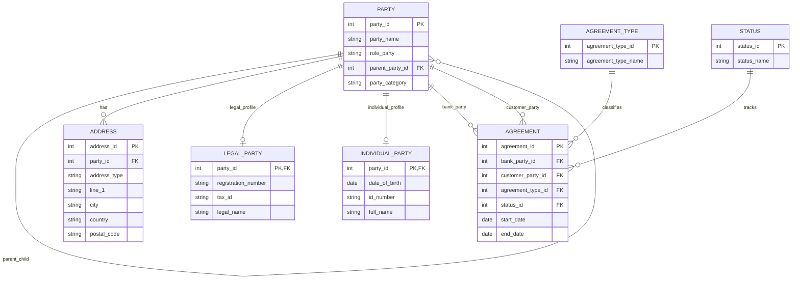

# Agreement ERD Data Model

## Business Context

Banking agreements involve multiple party roles, agreement types, lifecycle statuses, legal entities, individual customers, parent-child party hierarchies, and multiple address types.

The model below keeps agreement data normalized while allowing the same `PARTY` table to represent banks, customers, legal entities, and individuals.

## Data Model Summary

1. `AGREEMENT` is the central table.
2. `PARTY` represents both bank and customer parties.
3. `AGREEMENT` points to `PARTY` twice: once for bank and once for customer.
4. `PARTY.parent_party_id` supports parent-child hierarchy.
5. `LEGAL_PARTY` and `INDIVIDUAL_PARTY` specialize party details.
6. `ADDRESS` stores legal and postal addresses in one table.
7. `AGREEMENT_TYPE` and `STATUS` are lookup tables.

## Mermaid ERD

## Design Explanation

### Agreement as Hub

`AGREEMENT` is the hub table. It has its own primary key and foreign keys to:

- Bank party
- Customer party
- Agreement type
- Agreement status

This keeps the agreement structure clean and extensible.

### Single Party Table

The model uses one `PARTY` table for both bank and customer. This avoids duplicating similar columns across separate customer and bank tables.

`role_party` identifies whether the party is acting as:

- Bank
- Customer
- Counterparty
- Guarantor
- Other banking relationship role

### Parent-Child Party Hierarchy

`parent_party_id` on `PARTY` points back to `PARTY.party_id`. This supports corporate hierarchy:

- Parent company
- Subsidiary
- Branch
- Legal entity group

### Legal vs Individual Party

A party can be legal or individual, not both.

`LEGAL_PARTY` stores company-related fields.

`INDIVIDUAL_PARTY` stores person-related fields.

Both link back to `PARTY` through `party_id`.

### Address Design

`ADDRESS` supports multiple address types:

- Legal address
- Postal address
- Billing address
- Registered office address

The `address_type` column keeps address handling flexible without creating separate tables for every address category.

## Banking Product Relevance

This ERD can support agreement search, contract ingestion, KYC enrichment, customer hierarchy analysis, credit exposure views, and GenAI-assisted contract metadata extraction.
