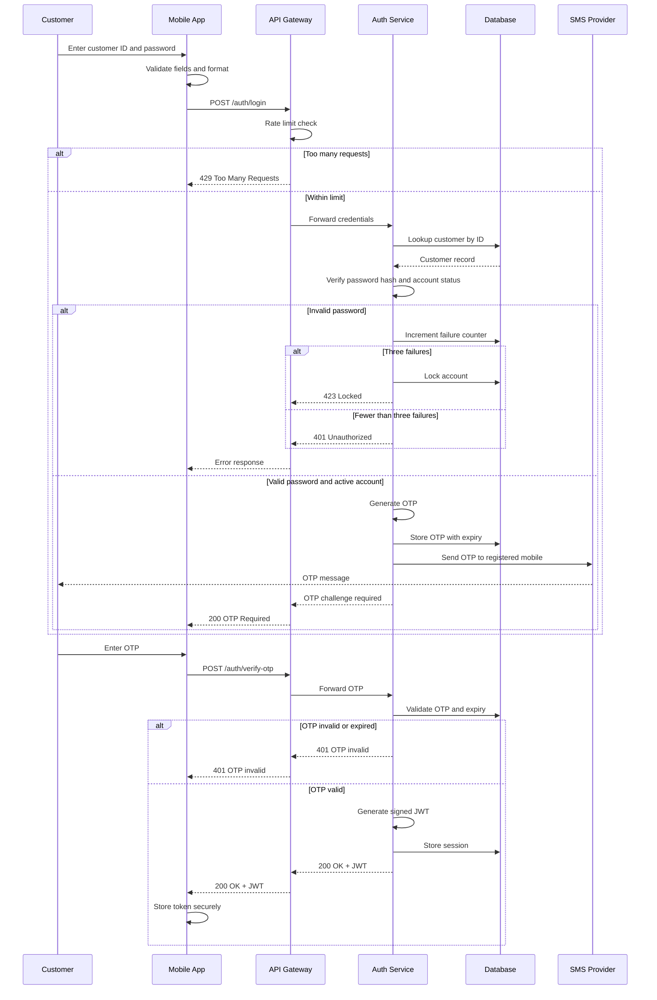

# Mobile Banking Authentication Sequence Flow

## Overview

This sequence flow models a secure mobile banking login process with password validation, rate limiting, OTP verification, account lockout, and JWT token issuance.

## Sequence Diagram

## Flow Explanation

1. Customer enters ID and password in the mobile app.
2. The app validates empty fields and format locally.
3. The app sends `POST /auth/login` to the API Gateway.
4. API Gateway checks rate limits before forwarding credentials.
5. Auth Service verifies customer ID, password hash, and account status.
6. Wrong password returns `401` and increments failure counter.
7. Three failed attempts lock the account and return `423`.
8. Valid password triggers OTP generation.
9. OTP is stored with expiry and sent through SMS.
10. Customer submits OTP through `POST /auth/verify-otp`.
11. Auth Service validates OTP and expiry.
12. Successful verification creates a signed JWT and session record.
13. Mobile app stores the token securely and uses it in the `Authorization` header.

## Security Controls

- Local input validation
- API gateway rate limiting
- Password hash verification
- Account status check
- Failed login counter
- Lockout after repeated failures
- OTP expiry
- JWT signing
- Session persistence
- Authorization header for subsequent API calls

## Product Relevance

The flow balances security and user experience. It also shows where product owners can define policies such as lockout threshold, OTP expiry window, session lifetime, and fallback recovery path.
